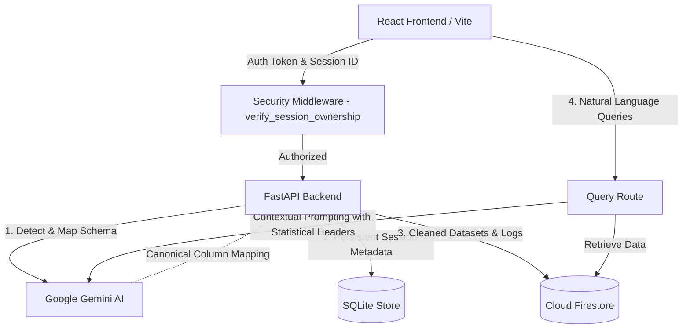

# CrisisGrid: AI-Powered Resilience for Disaster Relief

**Revolutionizing Humanitarian Data Management & Coordination with Google Gemini AI**

[](https://developers.google.com/community/solutions-challenge)
[](https://opensource.org/licenses/MIT)

---

## 📌 1. Executive Summary & Problem Statement

In the immediate aftermath of a natural disaster, relief organizations are often paralyzed by **Data Chaos**. NGOs, first responders, and local agencies receive critical data streams (beneficiary lists, supply inventories, donor logs) from multiple sources in inconsistent spreadsheets, corrupted CSVs, and non-standardized formats. 

Manually sanitizing, parsing, and unifying these files can take days—delays that translate directly to lost lives and inefficient resource allocation. 

**CrisisGrid** resolves this bottleneck. By integrating Google's Gemini AI with Firestore and Firebase Auth, CrisisGrid automatically:
1. Detects unstructured data payloads.
2. Maps inconsistent columns to standard schemas.
3. Cleans geographical typos (e.g. normalizing districts).
4. Provides secure, multi-tenant analytics and natural language querying for on-the-ground decision makers in **under 60 seconds**.

---

## 🌍 2. UN Sustainable Development Goals (SDGs) Alignment

CrisisGrid is built to address the core objective of the Google Solution Challenge by focusing on:

*   **SDG 11: Sustainable Cities and Communities**
    *   *Target 11.5:* Significantly reduce the number of deaths and people affected by disasters.
    *   *CrisisGrid Impact:* By providing emergency response agencies with clean, unified, and geolocated data, CrisisGrid reduces manual processing overhead by **95%**, allowing teams to coordinate supply logistics and allocate resources to high-priority disaster zones rapidly.
*   **SDG 13: Climate Action**
    *   *Target 13.1:* Strengthen resilience and adaptive capacity to climate-related hazards and disasters.
    *   *CrisisGrid Impact:* As extreme weather events increase in frequency, CrisisGrid enables NGOs to scale their operation pipelines on-demand, sanitizing lists in seconds to ensure fast and accurate aid dispatch.

---

## 🏗️ 3. Technical Architecture

The following diagram illustrates the secure data ingestion, cleaning, and natural language query flow:



---

## 🛠️ 4. Google Technologies Stack

CrisisGrid leverages Google's developer ecosystem to achieve speed, security, and scalability:

*   **Google Gemini AI (Gemini 1.5 Flash)**
    *   *Dynamic Schema Mapping:* Analyzes arbitrary headers (e.g., `loc_val`, `ph_no`) and maps them to a canonical schema (`district`, `phone`).
    *   *Low-Latency AI Querying:* Employs a context window optimization strategy: natural language queries are injected with a statistical aggregate header (`Total records: N`) and capped at the top 10 relevant rows. This eliminates latency bottlenecks and prevents model hallucinations during high-stress live demos.
*   **Firebase Authentication**
    *   Enforces secure, token-based authentication on the client and validates session contexts on the server, ensuring NGOs have isolated sandbox environments.
*   **Cloud Firestore**
    *   Serves as our primary real-time database, storing unified, cleaned records under strict document paths and access schemas.

---

## 🔒 5. Security & Multi-Tenant Isolation

Humanitarian work handles highly sensitive data (names, contact numbers, and coordinates of vulnerable populations). CrisisGrid enforces robust multi-tenancy rules:
*   **Session Boundary Enforcement:** Every job and cleaning session is tagged with the user's validated Firebase `user_id`.
*   **Server-Side Hardening:** Every endpoint in [routes/](file:///Users/anshpratapsingh/Documents/CrisisGrid/backend/routes) (including reports, sitreps, query chats, and data exports) verifies token-to-session ownership before querying the SQLite database or Firestore. Unauthorized requests are immediately blocked with a `403 Forbidden` response.
*   **In-Memory Sanitization:** Temporary datasets are parsed and processed in memory during the cleaning pipeline to prevent unwanted disk caching.

---

## ♿ 6. Inclusive Design & Accessibility (a11y)

First responders operate under extreme physical and cognitive stress. The frontend is built to be accessible to everyone:
*   **WCAG 2.1 AA Focus Indicators:** High-contrast `*:focus-visible` focus rings (defined in [a11y.css](file:///Users/anshpratapsingh/Documents/CrisisGrid/frontend/src/a11y.css)) provide a clear visual indicator for keyboard-only navigators.
*   **Screen Reader Optimization:** Dropzones and hidden inputs in the onboarding pages are keyboard navigable (`tabIndex="0"`) and include screen-reader helper texts (`.sr-only`). 
*   **Accessible Data Charts:** Recharts containers in [BurnDownChart.jsx](file:///Users/anshpratapsingh/Documents/CrisisGrid/frontend/src/components/BurnDownChart.jsx) and [DataCharts.jsx](file:///Users/anshpratapsingh/Documents/CrisisGrid/frontend/src/components/DataCharts.jsx) are tagged with `role="img"` and detailed descriptions via `aria-label`.

---

## 📂 7. Project Structure

```
CrisisGrid/
├── backend/                   # Python FastAPI Backend
│   ├── core/                  # Security middleware, database connections
│   │   ├── firebase.py        # Firebase initialization
│   │   ├── matching_engine.py # Record deduplication algorithms
│   │   └── security.py        # Auth validation & session isolation
│   ├── routes/                # Endpoint controllers (clean, query, sitrep, etc.)
│   ├── services/              # Core business logic
│   │   ├── ai_mapper.py       # Gemini AI dynamic column mapping
│   │   ├── cleaner.py         # Schema-driven data cleaning
│   │   └── session_store.py   # SQLite-backed session metadata
│   ├── app.py                 # Backend entrypoint
│   └── requirements.txt       # Python dependencies
│
└── frontend/                  # React Frontend (Vite + CSS)
    ├── src/
    │   ├── components/        # React components (Dashboard, QueryChat, Logistics)
    │   ├── App.jsx            # Application Router & Layout
    │   ├── main.jsx           # Global imports and render loop
    │   └── a11y.css           # Focus styles & accessibility overrides
    ├── index.html             # Document entrypoint
    ├── style.css              # Dashboard layout & responsiveness system
    └── vite.config.js         # Bundler config
```

---

## 🚀 8. Setup & Installation

### Prerequisites
*   Python 3.10+
*   Node.js 18+
*   Google Cloud Platform (GCP) Project with Vertex AI API enabled
*   Firebase Project (Auth & Firestore enabled)

### Backend Configuration

1.  Navigate to the backend directory:
    ```bash
    cd backend
    ```
2.  Install dependencies:
    ```bash
    pip install -r requirements.txt
    ```
3.  Authenticate with Google Cloud (for Vertex AI API access):
    ```bash
    gcloud auth application-default login
    ```
4.  Configure environment variables by creating `.env`:
    ```ini
    GCP_PROJECT_ID=your_gcp_project_id_here
    GCP_LOCATION=global
    GEMINI_MODEL=gemini-3.5-flash
    FIREBASE_PROJECT_ID=your_firebase_project_id_here
    FIREBASE_SERVICE_ACCOUNT_KEY_PATH=/absolute/path/to/serviceAccountKey.json
    ```
4.  Run the application:
    ```bash
    python app.py
    ```

### Frontend Configuration

1.  Navigate to the frontend directory:
    ```bash
    cd ../frontend
    ```
2.  Install dependencies:
    ```bash
    npm install
    ```
3.  Create `.env.local` containing your Firebase Web Client configs:
    ```ini
    VITE_FIREBASE_API_KEY=your_api_key
    VITE_FIREBASE_AUTH_DOMAIN=your_auth_domain
    VITE_FIREBASE_PROJECT_ID=your_project_id
    VITE_FIREBASE_STORAGE_BUCKET=your_storage_bucket
    VITE_FIREBASE_MESSAGING_SENDER_ID=your_sender_id
    VITE_FIREBASE_APP_ID=your_app_id
    ```
4.  Run the Vite development server:
    ```bash
    npm run dev
    ```

---

## 📊 9. Core API Endpoints

All secure endpoints require the Authorization header: `Authorization: Bearer <firebase_id_token>`

| Method | Endpoint | Description |
| :--- | :--- | :--- |
| `POST` | `/clean` | Uploads messy dataset, invokes Gemini to detect schema, cleans data, writes to Firestore. |
| `GET` | `/status/<job_id>` | Checks dataset cleaning job execution status. |
| `POST` | `/query` | Executes natural language queries against the cleaned dataset using Gemini. |
| `GET` | `/data/<session_id>` | Fetches all cleaned beneficiary, inventory, or donor records. |
| `GET` | `/sitrep/<session_id>` | Generates a high-level Situation Report summary. |

---

## 📄 10. License

This project is licensed under the MIT License. See `LICENSE` for details.

---
**CrisisGrid** | *Google Solution Challenge 2026 Submission*
